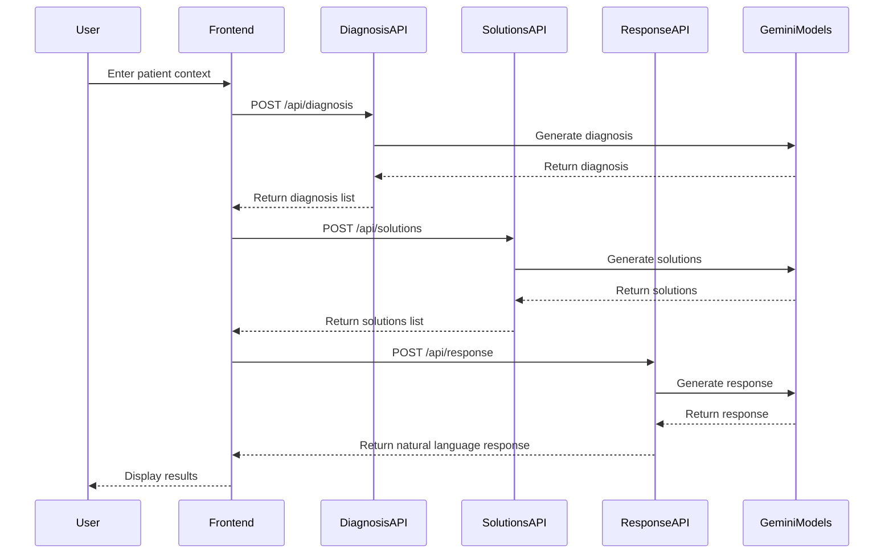

# Clara Copilot

## Overview

**Clara Copilot** is an intelligent assistant designed for **mental health counselors**. It allows you to enter patient details in natural language and outputs:

- A **set of categorized problems** relevant to the patient’s context  
- A **set of potential solutions**
- A **natural language summary** that combines the above and provides useful insights

Behind the scenes, Clara uses **two fine-tuned multi-label text classification models**:

1. **Problem Classifier** – maps patient context to categories of problems (e.g., *Anxiety*, *Relationship Issues*)
2. **Solution Classifier** – maps the same context to appropriate solutions (e.g., *CBT*, *Journaling*)

The app also aims to help counselors **explore perspectives they may have missed**, acting like a second brain during sessions.

---

## Product Design

Clara is built for **real-time support** during counseling sessions. Imagine a counselor in a 1-on-1 meeting with a patient—they need **quick, clear, and insightful suggestions**.

To support this, the app outputs:

- **Quick glanceable labels**: for fast idea validation or brainstorming
- **Detailed natural language summaries**: for deeper reading when needed

Why both? Sometimes, a counselor already has a direction in mind and just needs a **nudge** or **validation**. Other times, they may want a **fresh perspective**, which the natural language output provides.

---

## Dataset

**Source**: [Kaggle - NLP Mental Health Conversations](https://www.kaggle.com/datasets/thedevastator/nlp-mental-health-conversations/data)

This dataset includes **transcripts of conversations between patients and counselors**. After careful analysis, it became clear that:

- **Patient Context** can be mapped to a **class of problems**
- **Counselor Responses** can be used to infer a **class of solutions**

I created **two synthetic datasets** to train 2 models for **multi-label text classification**.

---

## Preparing Synthetic Datasets

### Dataset 1 – Problem Classification

**Goal**:  
Map a patient's natural language context to **problem categories**  
*(e.g., “I feel so anxious these days” → `["Anxiety"]`)*

**Processing Steps**:

1. Start with raw dataset: `[Patient Context, Counselor Response]`
2. Deduplicate by Patient Context
3. Clean Patient Context (tokenize, remove contractions, stopwords, punctuation)
4. Use **BERTopic** to extract topic labels
5. Combine topic output with an **LLM (Gemini)** to refine labels
6. Strip labels that appear less than 10 times
7. Remove null/empty/invalid rows
8. Final dataset format:  
   `[Patient Context (cleaned), Comma-separated problem labels]`

---

### Dataset 2 – Solution Classification

**Goal**:  
Map a patient's context to **solution strategies** based on **multiple counselor responses**  
*(e.g., “You could try CBT or journaling” → `["CBT", "Journaling"]`)*

**Original Format Example**:
- Patient Context 1, Counselor Response 1
- Patient Context 1, Counselor Response 2
- Patient Context 1, Counselor Response 3
- Patient Context 2, Counselor Response 1
- Patient Context 2, Counselor Response 2

Note: One Patient Context is mapped to multiple Counselor Responses

**Processing Steps**:

1. Start with raw dataset: `[Patient Context, Counselor Response]`
2. Clean Counselor Response (tokenize, remove contractions, stopwords, punctuation)
3. Use **LLM (Gemini)** to generate solution labels  
   *(BERTopic didn't work well here since the counselor response included more information about the patient's situation than solutions)*
4. Strip labels that appear less than 10 times
5. Remove null/empty/invalid rows
6. Group by Patient Context and merge solution labels from multiple responses
7. Final dataset format:  
   `[Patient Context (cleaned), Comma-separated solution labels]`

## 🧠 Training the ML Models

Since LLMs are strong in natural language understanding and classification, I fine-tuned **two Gemini models** on **Google Cloud Vertex AI**.

### Steps:

- Convert CSV datasets to `.jsonl` format
- Add system prompts tailored for each task
- Inject noisy samples (gibberish → label "None") to prevent overfitting
- Use **GCP Vertex AI** for training & deployment
- Integrate model endpoints into the app via **GCP SDK**

---

## ⚙️ System Design

- Frontend: Next.js, React, Tailwind CSS, ShadCN
- Backend: Next.js API Routes, Google Cloud Vertex AI
- Database: Not required, real-time predictions only
- Deployment: Vercel

# Thera Copilot System Design

## Architecture Overview

```mermaid
graph TD
    Client[Client Browser] --> |Next.js App| Frontend[Frontend Components]
    Frontend --> |API Routes| Backend[Backend Services]
    Backend --> |Google GenAI| AI[Gemini Models]
    
    subgraph Frontend Components
        UI[User Interface]
        Nav[Navbar]
        DP[Diagnosis Panel]
        CP[Chatbot Panel]
    end
    
    subgraph Backend Services
        API1[/api/diagnosis]
        API2[/api/solutions]
        API3[/api/response]
    end
    
    subgraph Gemini Models
        GM1[Diagnosis Model]
        GM2[Solutions Model]
        GM3[Response Model]
    end
```

## Component Details

### Frontend Components
1. **User Interface (`app/page.tsx`)**
   - Main application container
   - State management for user input and AI responses
   - Coordinates between Diagnosis and Chatbot panels

2. **Navbar (`components/Navbar.tsx`)**
   - Application header
   - Branding and navigation elements

3. **Diagnosis Panel (`components/DiagnosisPanel.tsx`)**
   - Displays identified problems
   - Shows possible solutions
   - Patient context display
   - Clear functionality

4. **Chatbot Panel (`components/ChatbotPanel.tsx`)**
   - User input handling
   - Message display
   - Loading states
   - Send message functionality

### API Routes

1. **Diagnosis API (`/api/diagnosis`)**
   - Endpoint: POST `/api/diagnosis`
   - Input: `{ patientContext: string }`
   - Output: `{ diagnosis: string }`
   - Model: Gemini Diagnosis Model
   - Purpose: Identifies potential problem areas from patient context

2. **Solutions API (`/api/solutions`)**
   - Endpoint: POST `/api/solutions`
   - Input: `{ patientContext: string }`
   - Output: `{ solutions: string }`
   - Model: Gemini Solutions Model
   - Purpose: Suggests possible solutions based on patient context

3. **Response API (`/api/response`)**
   - Endpoint: POST `/api/response`
   - Input: `{ patientContext: string, diagnosis: string[], solutions: string[] }`
   - Output: `{ response: string }`
   - Model: Gemini Response Model
   - Purpose: Generates natural language responses for counselors

### Gemini Models Configuration

1. **Diagnosis Model**
   - System Instruction: Mental health analysis assistant
   - Output Format: Comma-separated list of problem areas
   - Temperature: 1
   - Max Output Tokens: 8192

2. **Solutions Model**
   - System Instruction: Mental Health Copilot
   - Output Format: Comma-separated list of solutions
   - Temperature: 1
   - Max Output Tokens: 8192

3. **Response Model**
   - System Instruction: Mental health support tool
   - Output Format: Natural language response
   - Purpose: Aids counselors in treatment approach

## Data Flow



## Security Measures

1. **API Security**
   - CORS headers configuration
   - Content Security Policy
   - XSS Protection
   - Frame Options
   - Content Type Options
   - Referrer Policy

2. **Environment Variables**
   - GCP credentials management
   - API keys protection
   - Project configuration

## Technical Stack

- **Framework**: Next.js 15.3.1
- **Language**: TypeScript
- **UI Library**: React 19
- **Styling**: Tailwind CSS
- **AI Integration**: Google Generative AI
- **Development Tools**: ESLint, Turbopack

## Deployment Considerations

1. **Environment Setup**
   - Node.js LTS version
   - npm/yarn package manager
   - Google AI API credentials

2. **Build Process**
   - Development: `npm run dev`
   - Production: `npm run build`
   - Start: `npm run start`

3. **Environment Variables**
   - GCP credentials
   - Project configuration
   - API endpoints
   - Model configurations
